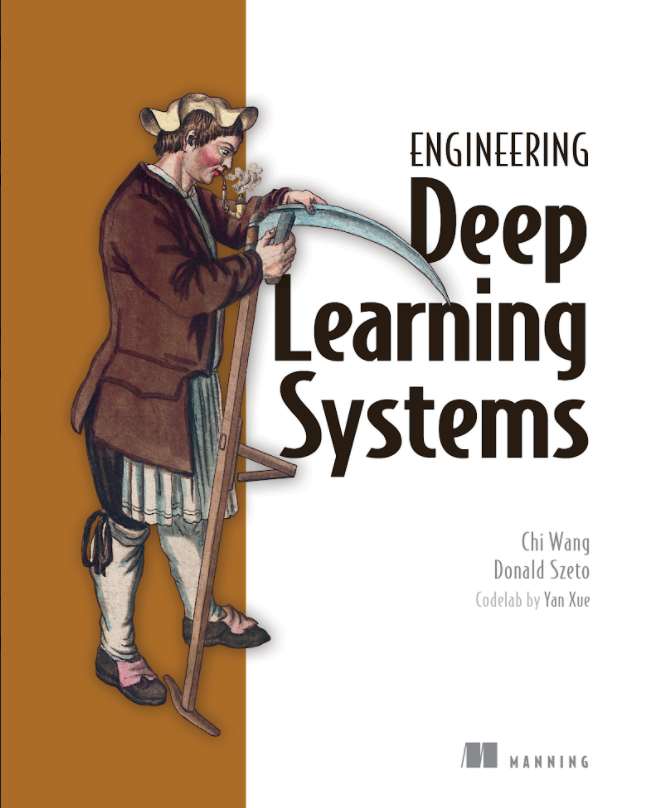

# MiniAutoML

This repository contains source code examples for `Engineering Deep Learning Platforms`. [Purchase link](http://mng.bz/GGgN).

> We are in Manning Early Access Program (MEAP) now! 50% off with code `mlwang2` till March 3rd

## System Requirement
The installation of system requirements are not included in the `scripts` folder. Please make sure those requirements are met before executing scripts in the `scripts` folder.

- **Operating system**: MacOs or Linux or WSL (Windows Subsystem for Linux).
- **Java JDK 11+**: 
  - Use `java --version` command to confirm your Java version.
  - Apache maven is not required to run the examples. We've bundled [Maven wrapper](https://github.com/takari/maven-wrapper) `mvnw` so that all the build commands we used in this repo depends only on `mvnw`.
- **Python3 & miniconda**
  - There are many ways to install python, if you don't have python yet, we recommend using [miniconda](https://docs.conda.io/en/latest/miniconda.html) to
    manage your python environments
  - in our python section we uses `conda` to setup python environments
- **Docker**: docker community edition can be downloaded from https://docs.docker.com/get-docker/. 
  - Use `docker version` command to verify both the client and the server are available/running.
- **Kubernetes**: docker community edition provides a standalone node kubernetes installation. You can enable it by following [official doc](https://docs.docker.com/desktop/kubernetes).
  - Use `kubectl version` command to verify both the client and the server are available/running.
- **Minio**: this is a storage system that we used in our examples to provide a shared file system for all our microservices. **Only the client is needed** (we will take care of starting/stopping server later in examples).
[The official doc](https://docs.min.io/docs/minio-client-quickstart-guide.html) talks about several ways to install it. We need the binary version (so that `mc` command is available).
  - For mac, do `brew install minio/stable/mc`.
  - For linux, follow the official doc to download the right minio client binary for your platform.
  - Use `mc --version` command to verify it has been successfully installed.
- **Grpcurl**: we found this [grpcurl](https://github.com/fullstorydev/grpcurl) tool a great way to demo grpc services in the commandline environment, so our example scripts use it extensively.
  - For mac, do `brew install grpcurl`
  - For linux, follow the project documentation to download the right binary
  - Use `grpcurl --version` command to verify it has been successfully installed.

## Module list

In the root folder you'll find a Maven project description file `pom.xml`, which describes a multi-module Java project. 
- `grpc-contract` module contains shared microservices grpc definitions as well as code generation automations.
- `data-management`, `metadata-store`, `prediction-service`, `training-service` each contains a runnable service comprising the Deep Learning System introduced in the book. The readme in the corresponding module talks about how to use it.
- `training-code` contains deep learning model training code for text classification, written in Python. [training-code/text-classification/Readme.md](training-code/text-classification/) talks about how to setup the Python environment.
- `scripts` contains demo bash scripts used in the `<<lab chapter>>` as well as individual module's readme file. We expect those scripts to be executed using repository root as the working directory.
- Dockerfile (`services.dockerfile`) builds all these microservices, producing ONE image that is capable of starting multiple services. Providing `<<module-name>>.jar` to the argument section of the `docker run` command can start the corresponding microservice. You can see example `docker run` command in [scripts/dm-002-start-server.sh](scripts/dm-002-start-server.sh).

## Next step
1. Checkout our [lab](lab.md) section
2. Look at the service definitions in [grpc-contract](grpc-contract)
3. Play with [data-management](data-management)
4. Play with [training-service](training-service)
