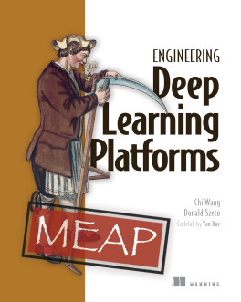

# MiniAutoML



This repository contains source code examples for `Engineering Deep Learning Systems`. [Purchase a copy here](http://mng.bz/GGgN). 

To demonstrate design principles introduced in the book, we built this mini system (5 micro-services) with Java (web API) and Python (model training code). The system can run on Mac or Linux if you have Docker and Kubernetes (optional) installed, and it addresses the core requirements of a machine learning system: dataset management, model training and model serving.  

Learning a deep learning system could be intimidating. The complexity of web services setup, intricacies of business logic, and variety of libraries and framework installations prevent us from getting to the core piece of a deep learning system. 
To enable you to easily access the core implementation of the system, we did several things to keep this demo system simple:
1. Use gRPC to build the web API to avoid boilerplate code.
2. Offer [shell scripts](/scripts/) to run the system and interact with services. 
3. Code is simple and short. Each service of the system is built with less than a few thousand lines of code. We only keep the bare minimum code that is sufficient to demonstrate the design principles.  

## System Overview
Our mini deep learning system consists of four services and one storage system, they are:

- **[Dataset management service](https://github.com/orca3/MiniAutoML/tree/main/data-management)**, designed for storing and fetching dataset. 
- **[Model training service](https://github.com/orca3/MiniAutoML/tree/main/training-service)**, designed for running model training code.
- **[Metadata store service](https://github.com/orca3/MiniAutoML/tree/main/metadata-store)**, designed for storing model metadata, such as model name, model version and model algorithm.
- **[Prediction service](https://github.com/orca3/MiniAutoML/tree/main/prediction-service)**, designed to execute models to process customer’s prediction requests.
- **MinIO storage**, an object storage similar to AWS S3 but can run on your local computer.

In the book [Engineering Deep Learning Systems](http://mng.bz/GGgN), each of these serivces gets their own chapter. To play with the system locally, please install the [system requirements](https://github.com/orca3/MiniAutoML#system-requirement) and then follow the instructions in the [lab](https://github.com/orca3/MiniAutoML#lab) section.

## System Requirements
The installation of system requirements are not included in the `scripts` folder. Please make sure those requirements are met before executing scripts in the `scripts` folder.

- **Operating system**: Recent versions of macOS, Linux or WSL (Windows Subsystem for Linux). Pre-built Docker containers have been tested to work on Apple M1 hardware without modifications.
- **JDK 11+**: 
  - Use `java --version` command to confirm your Java version.
  - Apache Maven is not required to run the examples. We've bundled [Maven wrapper](https://github.com/takari/maven-wrapper) `mvnw` so that all the build commands we used in this repo depends only on `mvnw`.
- **Anaconda**:
  - **IMPORTANT**: If you are running on Apple M1, make sure to download and install a version that
    supports it to avoid running into errors.
  - Create and activate a clean Conda environment before running the lab. Failing to do so may
    result in long initial setup time and failures.
- **Docker**: Docker Desktop can be downloaded from https://docs.docker.com/get-docker/. 
  - Use `docker version` command to verify both the client and the server are available/running.
  - The lab has been verified to work on Docker Desktop version >4.13.0, on both Intel and Apple chips.
- **Kubernetes**: Docker Desktop provides a standalone node Kubernetes installation. You can enable it by following [the official doc](https://docs.docker.com/desktop/kubernetes).
  - Use `kubectl version` command to verify both the client and the server are available/running.
- **Minio**: this is a storage system that we used in our examples to provide a shared file system for all our microservices. **Only the client is needed** (we will take care of starting/stopping server later in examples).
[The official doc](https://docs.min.io/docs/minio-client-quickstart-guide.html) talks about several ways to install it. We need the binary version (so that `mc` command is available).
  - For mac, do `brew install minio/stable/mc`.
  - For linux, follow the official doc to download the right minio client binary for your platform.
  - Use `mc --version` command to verify it has been successfully installed.
- **Grpcurl**: we found this [grpcurl](https://github.com/fullstorydev/grpcurl) tool a great way to demo grpc services in the commandline environment, so our example scripts use it extensively.
  - For mac, do `brew install grpcurl`
  - For linux, follow the project documentation to download the right binary
  - Use `grpcurl --version` command to verify it has been successfully installed.
- **JQ**: to simplify the JSON data parsing in shell script, our example scripts use this [JQ](https://stedolan.github.io/jq/) library when parse the return JSON object from our API calls.
  - For mac, do `brew install jq`
  - For linux, follow the instruction in [Download jq](https://stedolan.github.io/jq/download/)

## Module List

In the root folder you'll find a Maven project description file `pom.xml`, which describes a multi-module Java project. 
- `grpc-contract` module contains shared microservices grpc definitions as well as code generation automations.
- `data-management`, `metadata-store`, `prediction-service`, `training-service` each contains a runnable service comprising the Deep Learning System introduced in the book. The readme in the corresponding module talks about how to use it.
- `training-code` contains deep learning model training code for text classification, written in Python. [training-code/text-classification/Readme.md](training-code/text-classification/) talks about how to setup the Python environment.
- `scripts` contains demo bash scripts used in the `<<lab chapter>>` as well as individual module's readme file. We expect those scripts to be executed using repository root as the working directory.
- Dockerfile (`services.dockerfile`) builds all these microservices, producing ONE image that is capable of starting multiple services. Providing `<<module-name>>.jar` to the argument section of the `docker run` command can start the corresponding microservice. You can see example `docker run` command in [scripts/dm-002-start-server.sh](scripts/dm-002-start-server.sh).

## Lab

After installing the [system requirements](https://github.com/orca3/MiniAutoML#system-requirement): docker, Minio, grpcurl and JQ, you can use our lab scripts to setup the sample deep learning system locally and start to play with it, such building a NLP model. By exeucting these scripts one by one, you will see a complete deep learning cycle, from data collection to model training and model serving. 

It is strongly recommended to create and activate a brand new Conda environment before running any lab scripts to avoid long setup times and possible failures. You can do so by running
```shell
conda create --name miniautoml-lab
conda activate miniautoml-lab
```

***Please run the lab scripts from the root folder***, a side note for running our lab scripts successfully is to execute them from the root folder where you download this project.

The lab scripts are placed at the [scripts](/scripts/) folder. They start with the word "_lab_". Please execute them in order. See below explaination for each script.

- [scripts/lab-001-start-all.sh](scripts/lab-001-start-all.sh) pulls all the services' docker images, runs the containers and starts the system.
- [scripts/lab-002-upload-data.sh](scripts/lab-002-upload-data.sh) prepares some training data and uploads them to the dataset management service to build a dataset (a text dataset for intent classification). After execution, you will see the script print out a JSON object (see below example). This JSON object represents a dataset in the dataset management service, please pay attention to the `dataset_id` attribute, which will be used in model training. 
  ```
  {
    "dataset_id": "1",
    "name": "tweet_emotion",
    "dataset_type": "TEXT_INTENT",
    "last_updated_at": "2022-07-09T01:23:16.192376Z",
    "commits": [
      {
        "dataset_id": "1",
        "commit_id": "1",
        "created_at": "2022-07-09T01:23:16.968476Z",
        "commit_message": "Initial commit",
        "path": "dataset/1/commit/1",
        "statistics": {
          "numExamples": "2963",
          "numLabels": "3"
        }
      }
    ]
  }
  ```
- [scripts/lab-003-first-training.sh](scripts/lab-003-first-training.sh) kicks off a model training job with the dataset built by `lab-002-upload-data.sh`. This script will keep waiting until the training completes, it will then send out a prediction request to the prediction service, asking for model inference by using the newly built model.

  `lab-003-first-training.sh` script requires one input parameter - dataset_id, which you can get from the result of `lab-002-upload-data.sh`.
  ```
  ./scripts/lab-003-first-training.sh {dataset_id}
  ```
  for example: 
  ```
  $./scripts/lab-003-first-training.sh 1
  ```
  When model training completes, the script will print out a JSON object (see example below), which represents the model training job that produces the model. Please pay attention to the `run_id` attribute, we use the training run id to represent the model the training job produces. In our system, _model id_ = _run id_.  
  ```
  {
    "run_info": {
      "start_time": "2022-07-09T01:26:32.924614",
      "end_time": "2022-07-09T01:26:36.238346",
      "success": true,
      "message": "test accuracy    0.561",
      "run_id": "2",
      "run_name": "training job 2",
      "tracing": {
        "dataset_id": "1",
        "version_hash": "hashAg==",
        "code_version": "231c0d2"
      },
      "epochs": { 
        ... 
      }
    }
  }
  ```
- [scripts/lab-004-model-serving.sh](scripts/lab-004-model-serving.sh) sends a prediction request to the prediction service with a specified model id.

  `lab-004-model-serving.sh` script requires two input parameters - model id and document. You can get `model id` from the result of `lab-003-first-training.sh` - the `run_id` attribute, and you can type arbitrary text string for the `document` parameter.

  ```
  ./scripts/lab-004-model-serving.sh {run_id} {document}
  ```
  for example: 
  ```
  $./scripts/lab-004-model-serving.sh 2 "hello world"

  model_id is 1
  document is hello world
  {
    "response": "{\"result\": \"joy\"}"
  }
  ```

- [scripts/lab-999-tear-down.sh](scripts/lab-999-tear-down.sh) stops and remove all the services (docker containers)

- [scripts/lab-005-second-training.sh](scripts/lab-005-second-training.sh) is very similar to `lab-003-first-training.sh`, this is a bonus scenario for updating an existing dataset and retain a model. This script is the answer to a quiz of the chapter two - **Ch 2, A Hello World Deep Learning System**.

## Next Steps
1. Look at the service definitions in [grpc-contract](grpc-contract)
2. Play with [data-management](data-management)
3. Play with [training-service](training-service)
